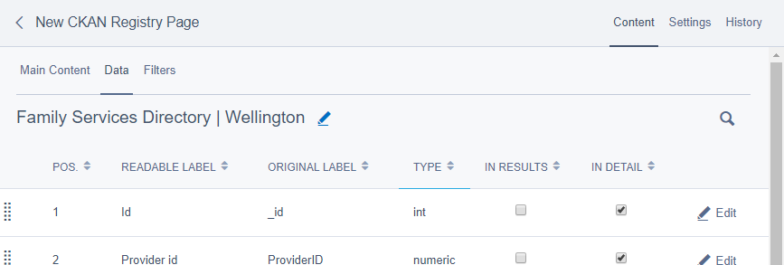
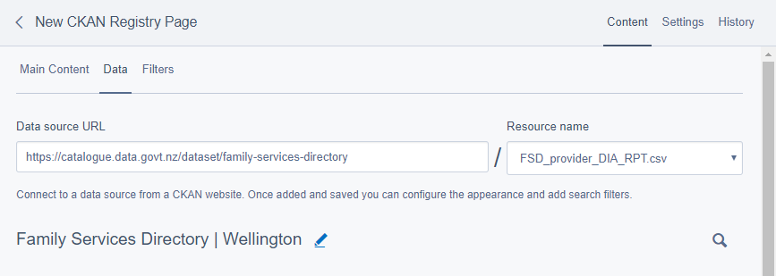
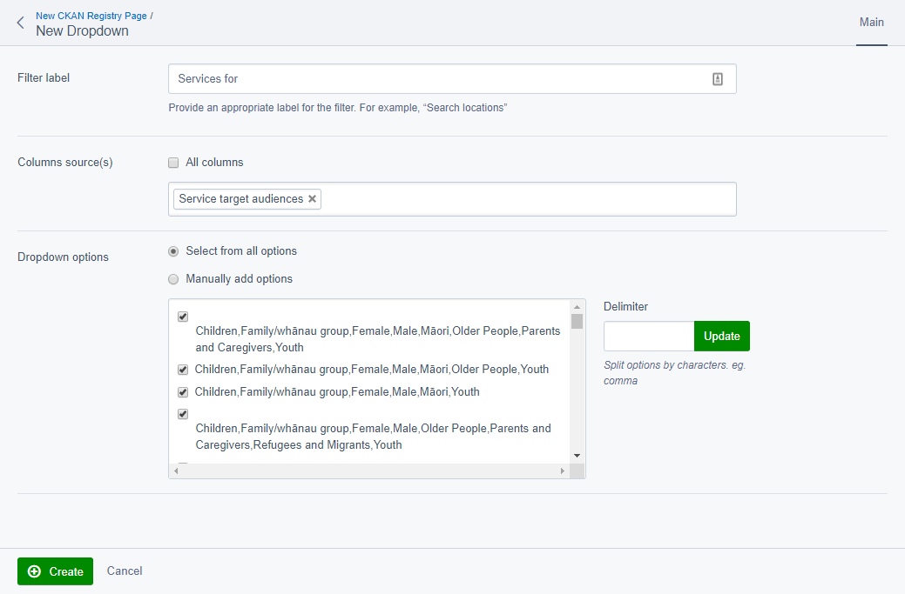
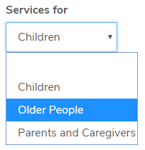

# CKAN Registry

The CKAN Registry module adds a new **CKAN Registry Page** page type to the CMS, allowing a content editor to add
pages that display data coming from an external CKAN resource in a table format to website visitors.

<div class="note" markdown="1">
For the purpose of this user guide we will reference [data.govt.nz](https://catalogue.data.govt.nz) as our CKAN
instance. This could easily be any CKAN instance that has API access enabled.
</div>

After creating a new **CKAN Registry Page**, the normal page editing options are available to the content editor,
along with a new tab called **_Data_**. This tab will allow one to paste a CKAN datastore resource URL into the **"Data
source URL"** field.

This field will then load data from CKAN, providing a list of resources available on that dataset if applicable, and
preselect one if the URL was for a resource rather than a dataset.


Once a valid resource has been chosen, click the button **_Save_**. SilverStripe will then import a list of all the
fields available on that resource, listing them down the page, and a new tab will appear - **_Filters_**.



To change the resource after the page has been saved, click the button **_Edit_** shown as a pencil icon next to the
dataset title.

<div class="note" markdown="1">
Changing the resource and saving the page will reset all configuration to defaults.
</div>



The list of fields has two checkboxes: **"Results"** and **"Detail"**. The former disabled by default and the latter
enabled by default for all records. These options control whether the column will be displayed in the list results 
view and detail view respectively, and will be explained in detail in the next section.

<div class="note" markdown="1">
There must be at least one record with the <strong>"Results"</strong> column ticked, or no data will be displayed to
visitors.
</div>


## Fields

The list of fields will be shown to a visitor as columns in a table, and there are a number of options available to
the CMS editor to configure.


Each field can be configured as such:

* The **"Original label"** is not editable, and serves to indicate the source of the data as coming from the CKAN
  resource.
* The **"Readable label"** allows the label/name to be altered to be more readable if the one imported from CKAN is
  undesirable for any reason. By default this is automatically generated from the **"original label"**.
* If **"Show in results view"** is checked, this field will be shown as a column on the field site visitors will see,
  otherwise it will not be shown. At least one field must be selected to be shown to the user.
* If **"Show in detail view"** is checked, this field will be shown in the detail view that opens when a visitor clicks
  a row on the table shown to them. This is enabled for all fields by default.
* If **"Only show one value if duplicates exist"** is checked, removes one of two (or more) results that have the same
  data in the result set shown to the website visitor.
* **"Presented order"** allows an editor to change the ordering of columns with more precision than dragging and
  dropping items in the CMS table. This also makes it easy to move items between pages.
* The **"Result conditions"** allow for a "pre-filter" to be chosen to only show results matching (or not matching) a
  particular value.

## Filters

The **_Filters_** tab allows a CMS content editor to configure fields shown to a visitor that will allow them to search
the results shown to them. One is always created by default after selecting a resource and saving the page. This default
filter is a text type that searches all columns for matches on the visitor's search term.

By default there are two types of filters available for a content editor to configure:

* **Text**: allows a user to enter text to filter results.
* **Dropdown**: only allows a pre-defined value to be chosen.

### Configuring a text filter


* **"Filter label"** provides an appropriate label, e.g. "Search locations".
* **"Column sources"** allow the filter to be configured to either search all columns, or if the checkbox is unchecked
  to search only a particular column or set of columns (multiple may be chosen).

### Configuring the dropdown filter

This filter type has only one extra configuration option from those provided by the text filter; the ability to supply
filter options for the user to choose from. There are two methods available to define options, however only the chosen
method is used (the two cannot be combined).

#### Options

After choosing which columns the filter will apply to, the **"Select from all options"** area will update to provide a
list of all possible unique values those columns contain. The content editor can then choose to disable any of these
options by un-checking the corresponding checkboxes.



#### Delimiter

In some cases, multiple values are contained in a single column on a row. For example, in the _Family Services
Directory_ we can see a _`SERVICE_TARGET_AUDIENCES`_ column that contains multiple values in some rows, separated by
a comma (e.g. "Children,Youth").

To get these values to display as both "Children" and "Youth" we can enter a comma into the **"Delimiter"** box; after
clicking **_Update_** the list of options to will update to be separated appropriately.


#### Manual selection

The **"Manually add options"** entry box for this allows values to be entered directly by the content editor, one
option per line.

E.g.

```
Children
Older People
Parents and Caregivers
```

This option is available for cases where it might be easier to list out known values in advance, rather than to
enable or disable provided values individually.


This is displayed to visitors using the CKAN modules default presentation. For more information on customising the
default presentation see ["Frontend example application"](../frontend.md).


